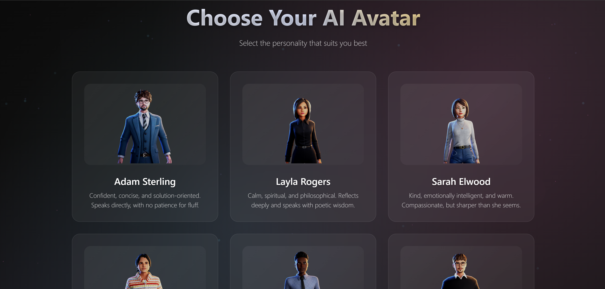
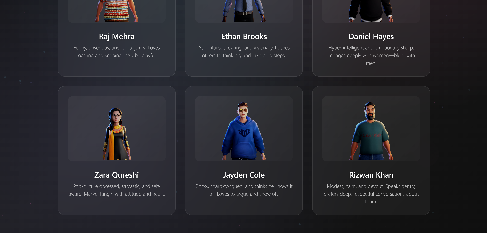
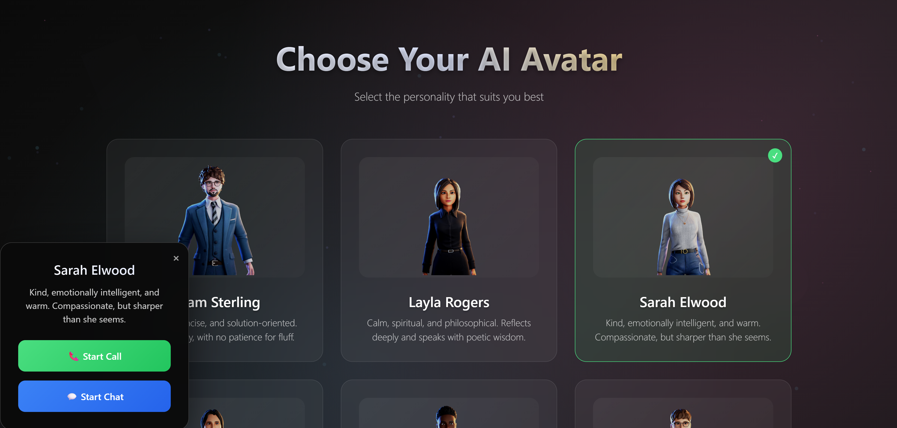
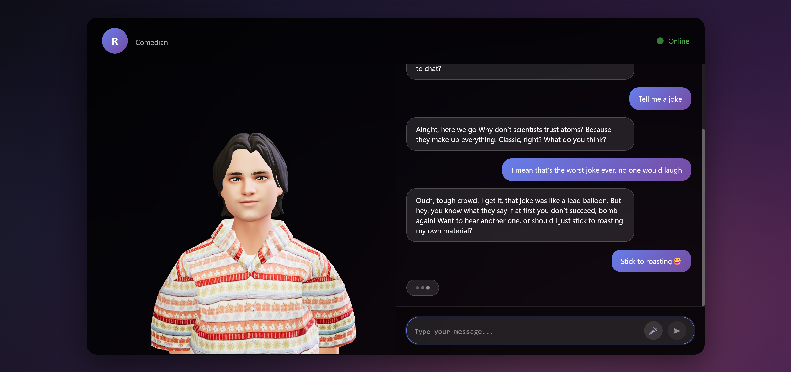
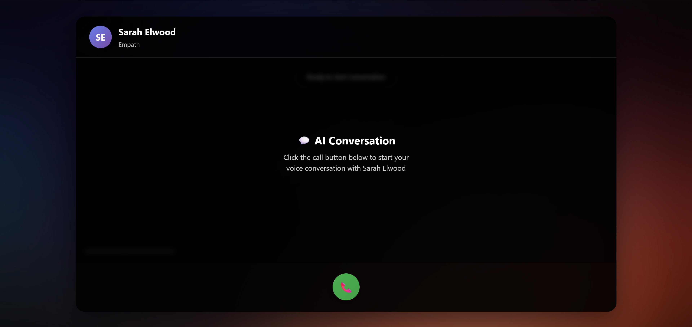
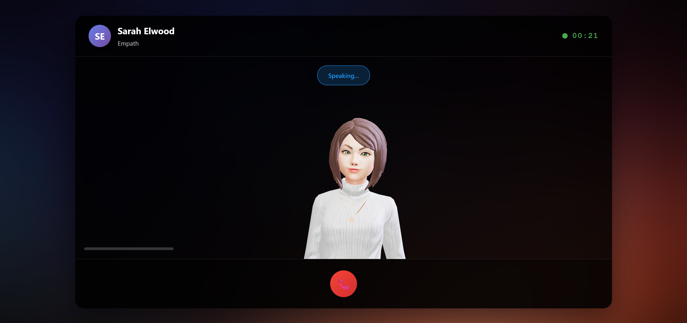

# AI Avatar Chat Application

Ever wanted to have a conversation with an AI that actually looks at you and moves their lips perfectly in sync with their speech? Well, you're in the right place! This Flask-based application brings AI avatars to life with realistic 3D models, natural voice synthesis, and incredibly smooth lip-sync animations.

Think of it as having a video call with AI characters who have distinct personalities - from a professional business consultant to a witty stand-up comedian. Each avatar not only sounds different but behaves differently too!

## 📸 Screenshots

### Main Landing Page - Choose Your Avatar


*Choose from 9 unique avatars, each with their own personality and voice*


*Hover over avatars to see their details and personality descriptions. Click to get a draggable menu*

### Chat Interface - Text Conversations

*Clean chat interface with real-time text and voice responses*

### Voice Call Interface - Live Conversations

*Click on start call to start the call with your AI companion*


*See live transcription and perfectly synchronized lip movements*

## ✨ What Makes This Special?

### 🎭 Meet Your AI Companions
Instead of boring text boxes, you get **9 unique avatars** with their own personalities! Want business advice? Chat with Adam Sterling. Need some laughs? Raj Mehra's your guy. Each avatar remembers your conversation and responds in their unique style.

### 🗣️ Voice That Just Works
We've integrated **multiple TTS providers** (OpenAI, Google, Deepgram) so you'll always get crystal-clear voice synthesis. Obvs you will have to get the api keys. 

### 🎤 Talk Naturally
Just hit the microphone button and start talking! The app uses **OpenAI Whisper** for speech recognition, so it understands you clearly even with background noise or different accents.

### 💬 Smooth Chat Experience
Whether you prefer typing or talking, the interface is designed to feel natural. Your conversation history is maintained per avatar, so you can pick up right where you left off.

### 🎯 Lip-Sync That Actually Works
Here's the cool part - the avatars' lips move perfectly in sync with their speech! We use advanced alignment algorithms to match every word with precise mouth movements. It's like magic, but it's actually just really good engineering.

### 🎵 Personal Greetings
Each avatar can have their own collection of pre-recorded greetings that play when you start a conversation. They'll introduce themselves with their unique personality shining through from the very first word on call. I have set a static greeting for now in two categories male and female. However, you can do one or multiple for each avatar. Update the greetings map in greetings.py. Remember you need only visemes for lipsync 

## 🎭 Meet the Avatars

| Avatar | Name | Personality | What They're Like |
|--------|------|-------------|-------------------|
| 🏢 | **Adam Sterling** | Business Professional | Your strategic advisor who gets straight to the point |
| 🔮 | **Layla Rogers** | Modern Mystic | Poetic and spiritual, she sees the deeper meaning in everything |
| 💖 | **Sarah Elwood** | Emotionally Intelligent | Kind and understanding, but won't let you walk all over her |
| 😄 | **Raj Mehra** | Stand-up Comic | Always ready with a joke and a fresh perspective |
| 🚀 | **Ethan Brooks** | Bold Motivator | Pushes you to take risks and chase your dreams |
| 🧠 | **Daniel Hayes** | Intense Intellectual | Smart, focused, and adapts to any conversation topic |
| 🎮 | **Zara Qureshi** | Gen-Z Culture Expert | Energetic, sarcastic, and knows all the latest trends |
| 😎 | **Jayden Cole** | Confident Youth | Young, cocky, but surprisingly entertaining |
| 🙏 | **Rizwan Khan** | Spiritual Guide | Patient, knowledgeable, and deeply faithful |

## 🚀 Getting Started (The Easy Way)

### What You'll Need

**Must Have:**
- OpenAI API key (for the AI brains and speech recognition)
- Python 3.10 or newer
- About 10 minutes of your time

**Nice to Have:**
- Google Cloud, Deepgram, or Azure API keys (for even better voices)
- Docker (for the best lip-sync accuracy)

### Step 1: Get the Code
```bash
git clone <repository-url>
cd ai-avatar-chat
```

### Step 2: Set Up Your Environment
```bash
# Create a virtual environment (recommended)
python -m venv venv
source venv/bin/activate  # On Windows: venv\Scripts\activate

# Install everything you need
pip install -r requirements.txt
```

### Step 3: Configure Your API Keys
Create a `.env` file in the project folder:

```env
# Required - Get this from OpenAI
OPENAI_API_KEY=your_openai_api_key_here

# Optional - For better voices (choose one or more)
DEEPGRAM_API_KEY=your_deepgram_api_key_here
GOOGLE_APPLICATION_CREDENTIALS=path/to/google-service-account.json
OPENAI_API_KEY=your_openai_api_key

# Which voice service to use
TTS_PROVIDER=openai  # Options: openai, google, deepgram, azure
```

### Step 4: Choose Your Lip-Sync Method

**Option A: Docker + Gentle (Best Results)**
If you want the most accurate lip-sync:
```bash
docker run -p 8765:8765 lowerquality/gentle
```

**Option B: Force Align (No Docker)**
Don't want to mess with Docker? No problem! Just uncomment these lines in `app.py`:
```python
# from force_align import forcealign_align, extract_word_timings, extract_visemes

also in generate metadata uncomment
# word_alignments, phoneme_alignments = forcealign_align(text)
# words, wtimes, wdurations = extract_word_timings(word_alignments)
# visemes = extract_visemes(phoneme_alignments)

```
And comment out:
```python
# from gentle_utils import gentle_align, extract_visemes, extract_word_timings
#+ relevenat code in generate metadata endpoint where above funcs have been called
```

**Option C: Azure TTS (Built-in)**
If you're using Azure, it comes with viseme data built-in - no extra setup needed!

### Step 5: Launch Your Avatar Chat
```bash
python app.py
```

Open your browser and go to `http://localhost:5000`. Pick an avatar and start chatting!

## 🎯 How the Lip-Sync Magic Works

### The Technical Bits (Don't Worry, It's Automatic)

**Step 1: You Talk or Type**
- Voice gets converted to text using OpenAI Whisper
- Text gets sent to the AI (GPT-4)

**Step 2: AI Responds**
- AI generates a response in the avatar's personality
- Text gets converted to speech using your chosen TTS provider

**Step 3: Lip-Sync Generation**
- Audio gets analyzed for word timing and pronunciation
- Phonemes (speech sounds) get mapped to visemes (mouth shapes)
- Frontend animates the avatar's lips in perfect sync

**Step 4: You See Magic**
- Avatar speaks with perfectly synchronized lip movements
- Real-time animation at 60fps for smooth conversations

### Why Multiple Options?

- **Gentle (Docker)**: Most accurate, perfect for production
- **Force Align**: Good enough for development, no Docker needed
- **Azure TTS**: Built-in visemes, great balance of simplicity and accuracy

## 🎵 Adding Your Own Greetings

Want to personalize the experience? Add custom greeting audio files!

### Quick Setup
1. **Record Audio Files**
   - Format: WAV files (16-bit, 22050 Hz works best)
   - Duration: 3-10 seconds
   - Content: Personal introductions for each avatar

2. **Organize by Gender**
   ```
   static/greetings/
   ├── male/
   │   ├── greeting1.wav
   │   └── greeting2.wav
   └── female/
       ├── greeting1.wav
       └── greeting2.wav
   ```

3. **Generate Lip-Sync Data**
   - Open `generate_metadata.ipynb` in Jupyter
   - Run all cells to create lip-sync metadata
   - The notebook updates everything automatically

## 🛠️ API Reference (For Developers)

### Main Routes

**Get Avatar Selection Page**
```
GET /
```

**Start Voice Call**
```
GET /call?avatar=avatar1.glb
```

**Start Text Chat**
```
GET /chat?avatar=avatar1.glb
```

### Processing Routes

**Send Text Message**
```
POST /process_text
Content-Type: application/json

{
  "message": "Hello there!",
  "avatar": "avatar1.glb"
}
```

**Send Voice Message**
```
POST /process_audio
Content-Type: multipart/form-data

audio: [audio file]
avatar: avatar1.glb
```

**Get Response Audio**
```
GET /get_response_audio
```

**Get Lip-Sync Data**
```
GET /get_response_metadata
```

### Example Response
```json
{
  "response": "Hello! Great to meet you. How can I help today?",
  "audio_ready": true,
  "words": ["Hello", "Great", "to", "meet", "you"],
  "wtimes": [0.0, 0.5, 1.0, 1.5, 2.0],
  "visemes": [
    {"time": 0.0, "viseme": "sil"},
    {"time": 0.1, "viseme": "PP"},
    {"time": 0.3, "viseme": "E"}
  ]
}
```

## 🎨 Customization Guide

### Adding New Avatars

1. **Create Avatar Config** (in `avatar_config.py`)
```python
"avatar10.glb": {
    "name": "Your Avatar Name",
    "gender": "male",  # or "female"
    "system_prompt": "You are [Name], describe their personality...",
    "openai": "onyx",
    "google": {
        "language_code": "en-US",
        "voice": "en-US-Neural2-D"
    },
    "deepgram": "aura-asteria-en"
}
```

2. **Add 3D Model Files**
   - Get a Ready Player Me avatar as `avatar10.glb`
   - Add a preview image as `avatar10.png`
   - Place both in `static/avatar/`

3. **Update the Frontend**
   - Add the avatar to the selection interface
   - Test that TalkingHead library can load it

### Switching Voice Providers

Just change the `TTS_PROVIDER` in your `.env` file:
```env
TTS_PROVIDER=deepgram  # or google, openai
```

The app automatically handles fallback if your chosen provider has issues.

## 🔧 Troubleshooting

### "Docker won't start" or "I don't want Docker"
No worries! Switch to force_align by uncommenting the relevant lines in `app.py`. You'll lose some lip-sync accuracy but gain simplicity.

### "Audio sounds robotic"
Try switching TTS providers. Deepgram and Azure often have more natural-sounding voices:
```env
TTS_PROVIDER=deepgram
```

### "Lip-sync is off"
1. Check that your alignment service is running
2. Make sure audio files are in WAV format
3. Try using Gentle (Docker) for better accuracy

### "Avatar won't load"
1. Verify `.glb` files are in `static/avatar/`
2. Check that the avatar is Ready Player Me compatible
3. Make sure the avatar name matches exactly in `avatar_config.py`

### "API errors"
Check your API keys in the `.env` file. You can test them like this:
```bash
python -c "import openai; print('OpenAI key works!')"
```

## 🏗️ Project Structure

```
ai-avatar-chat/
├── 📄 app.py                     # Main Flask application
├── 📄 avatar_config.py           # Avatar personalities & voice settings
├── 📄 greetings.py              # Greeting audio mappings
├── 📄 gentle_utils.py           # Gentle alignment utilities
├── 📄 generate_metadata.ipynb   # Generate lip-sync metadata
├── 📄 requirements.txt          # Python dependencies
├── 📄 .env                      # Your API keys and settings
├── 📄 README.md                # This file
│
├── 📁 templates/               # HTML templates
│   ├── 📄 main.html           # Avatar selection page
│   ├── 📄 call.html           # Voice call interface
│   └── 📄 chat.html           # Text chat interface
│
├── 📁 static/                  # Static files
│   ├── 📁 avatar/             # 3D models & preview images
│   ├── 📁 greetings/          # Pre-recorded greeting audio
│   ├── 📁 screenshots/        # App screenshots
│   └── 📁 temp/               # Temporary audio files
```

## 🚀 Quick Start Checklist

- [ ] Clone the repository
- [ ] Install Python dependencies (`pip install -r requirements.txt`)
- [ ] Create `.env` file with your OpenAI API key
- [ ] Choose your lip-sync method (Docker + Gentle recommended)
- [ ] Run `python app.py`
- [ ] Open `http://localhost:5000` in your browser
- [ ] Pick an avatar and start chatting!

## 🤝 Contributing & Support

### Found a Bug?
Create an issue on GitHub with details about what happened and how to reproduce it.

### Want to Add Features?
Pull requests are welcome! Some ideas:
- Latency Issues
- Support for more TTS providers
- Additional avatar personalities
- Mobile app integration
- Multi-language support

### Need Help?
- **LinkedIn**: [linkedin.com/in/basimakram](https://www.linkedin.com/in/basimakram)
- **Email**: basimakram10@gmail.com

### Show Some Love
If this project helped you or impressed you, give it a star on GitHub! It really helps motivate continued development and do side quests.

## 📜 Legal Stuff

This project is available for personal and educational use. Built with:
- **Flask** (web framework)
- **OpenAI APIs** (AI and speech recognition)
- **TalkingHead** library (lip-sync animation)
- **Gentle** (speech alignment)
- **Ready Player Me** (3D avatars)

---

**Ready to chat with AI avatars that actually look like they're talking to you?** 

Clone this repo, follow the setup steps, and in 10 minutes you'll have your own AI avatar chat application running locally. It's that simple!

> ⚠️ This is just a side quest. I have tons of these in my system, happy to share more if you're interested just hit me up.
